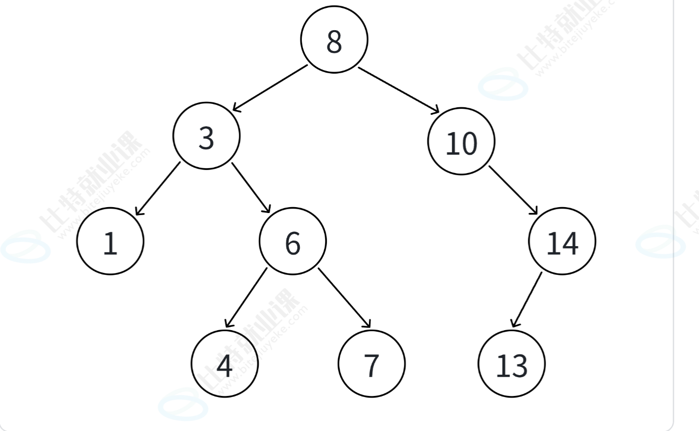
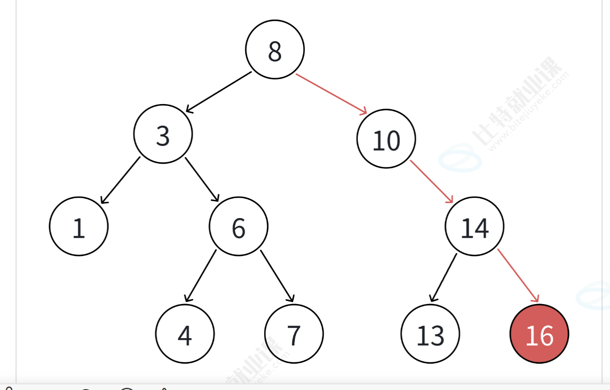
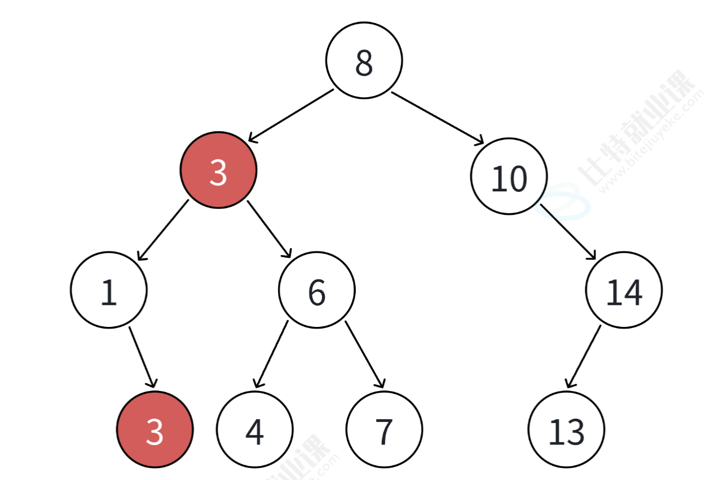
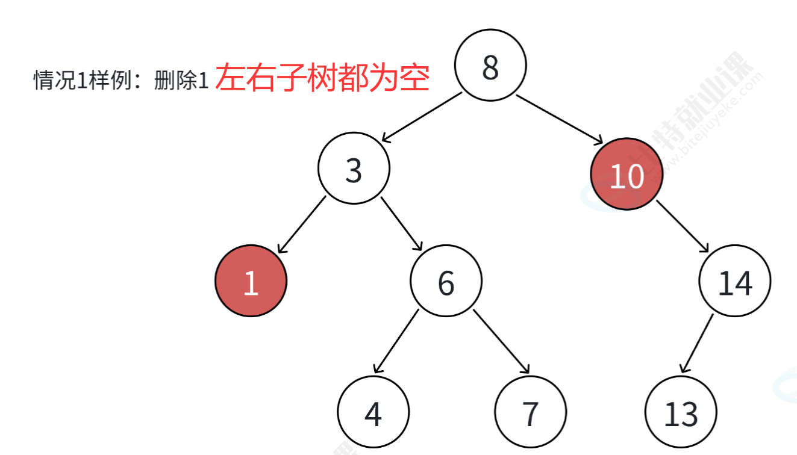
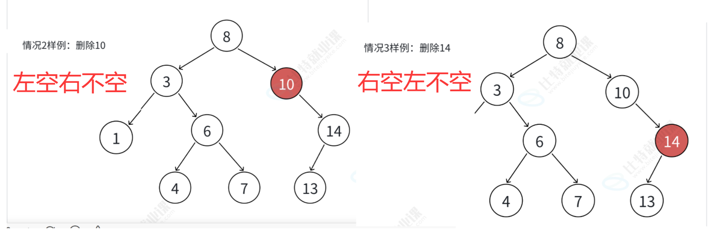
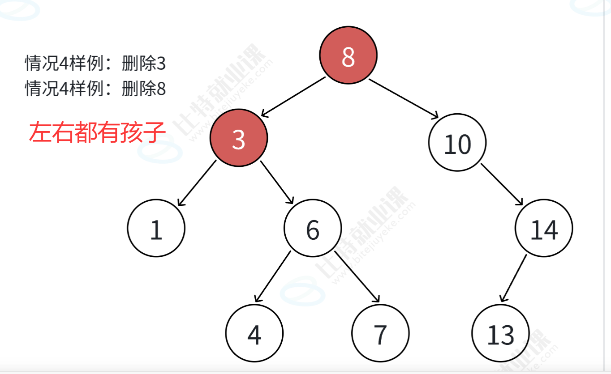

<center>
    <!-- 头像部分，已修正样式解析问题 -->

    <br>
    <!-- 博主信息文字，已修正style分号错误 -->
    <p style="font-size: 18px; font-weight: bold; margin: 10px 0;"><b>
     ⭐️博主： <font color="#ff"><b>  此生决int-@CSDN博客</b></font>
 <center>
<font color="#ff4d4f"><b>&emsp;速胜派就是最大的投降派！！！</b></font>    
</center
 
 
<div align="center">

**&emsp;&emsp;&emsp;&emsp;&emsp;&emsp;&emsp;&emsp;&emsp;🔥热门专栏🔥**

**[&emsp;&emsp;&emsp;&emsp;&emsp;&emsp;深入理解 C++ 系列](https://blog.csdn.net/2502_94353935/category_13191461.html)** ｜ **[算法系列](https://blog.csdn.net/2502_94353935/category_13148263.html)**

**[&emsp;&emsp;&emsp;&emsp;&emsp;&emsp;快速复习系列](https://blog.csdn.net/2502_94353935/category_13135388.html)** ｜ **[Java 速通系列](https://blog.csdn.net/2502_94353935/category_13190969.html)**

</div>

---
@[TOC](文章目录)
## 上期回顾

  上一篇我们主要学习了 **（上期内容）**，重点掌握了 **（知识点）**。如果还有印象模糊的地方，建议先回顾上一篇内容，再继续阅读本文。

# 一. 二叉搜索树

## 1. 二叉搜索树的概念
顾名思义，就是一颗主要**用于搜索的特殊的二叉树**，所以，它肯定具有二叉树的所有性质，我们这里的二叉树就不是用数组来模拟了，而是链式结构！
与普通二叉树的区别就是它具有一下的**性质**：

 1. **对于每一个根节点形成的一颗树，左边的所有节点小于等于根节点，右边的所有节点大于等于根节点**
2，关于这里的**等于**这一点，他们是两种不同的，我们后面学习的**map/set不支持等于**（用的多），**multimap/multiset支持等于**


### **2，为什么**我们要引入二叉搜索树？它的优势是什么？
首先，我们想要一个可以**快速频繁查找**的结构，我们这后面学的数据结构主要就是围绕这一点来学习，那么我们之前学习了**二分查找**，也非常快，但是它要求**数组，并且是有序的数组**，这就导致了它的缺点很明显，数组会导致**它的插入删除非常不方便**，
所以，就设计了二叉搜索树这一个结构，那么，它的查找效率是多少呢？

## 2. 二叉搜索树的性能分析

最优情况下，二叉搜索树为完全二叉树（或者接近完全二叉树），其高度为：log_2 底N
最差情况下，二叉搜索树退化为单支树（或者类似单支），其高度为：N
所以综合而言二叉搜索树增删查改时间复杂度为：**O(N)**

那么这样的效率显然是无法满足我们需求的，我们后续课程需要继续讲解二叉搜索树的变形，平衡二叉搜索树 AVL 树和红黑树，才能适用于我们在内存中存储和搜索数据。
### 关于搜索总结：
1，**二分查找——效率logN**，但是有两大缺陷：
1. 需要存储在支持下标随机访问的结构中，并且有序。
2. 插入和删除数据效率很低，因为存储在下标随机访问的结构中，插入和删除数据一般需要挪动数据。

2，**二叉搜索树——N**
插入删除方便，优化后，可以达到logN
优化后的结构：AVL树，红黑树等
3，**哈希表——O（1）**

# 二叉搜索树的模拟实现
接下来，我们来模拟实现一个最普通的二叉搜索树的一些关键接口函数，主要是**删除**接口函数的实现，是本文的重点。
## 1. 插入insert

插入的具体过程如下：

1. 树为空，则直接新增结点，赋值给 root 指针
2. 树不空，按二叉搜索树性质，插入值比当前结点大往右走，插入值比当前结点小往左走，找到空位置，插入新结点。
3. 如果支持插入相等的值，插入值跟当前结点相等的值可以往右走，也可以往左走，找到空位置，插入新结点。（要注意的是要保持逻辑一致性，插入相等的值不要一会往右走，一会往左走）
可以利用下面的图片自己模拟一下插入16的过程，还是比较简单的


### 主播的实现代码：
```cpp

```
```cpp
// 插入，判断插入是否成功即可
bool Insert(const K& key)
{
	Node* newnode = new Node(key);
	if (_root == nullptr)
	{
		_root = newnode;
		return true;
	}
	//肯定要先找到你要插入的位置，肯定是插入到叶子节点
	Node* parent = nullptr;
	Node* cur = _root;
	while (cur)
	{
		parent = cur;
		//if (key < cur->_key)保证parent和cur是链接起来的
		if (key < parent->_key)
		{
			cur = parent->_left;
		}
		else if (key > parent->_key)
		{
			cur = parent->_right;
		}
		else
		{				
			//return false;防止内存泄露
			delete newnode;
			return false;
		}
	}
//找到了插入位置
	//cur = newnode;
	if (key < parent->_key)parent->_left = newnode;
	if (key > parent->_key)parent->_right = newnode;
	return true;
}
```
### 需要注意的点：
记得delete 节点


## 2.查找find
过程：
1. 从根开始比较，查找 x，x 比根的值大则往右边走查找，x 比根值小则往左边走查找。
2. 最多查找高度次，走到到空，还没找到，这个值不存在。
3. 如果不支持插入相等的值，找到 x 即可返回
4. 如果支持插入相等的值，意味着有多个 x 存在，一般要求**查找中序的第一个 x**。如下图，查找 3，要找到 1 的右孩子的那个 3 返回，但是下面主播的代码主要实现不含重复元素的插入

### 主播的实现代码：
```cpp
// 查找,找到在不在即可
bool Find(const K& key)
{
	if (_root == nullptr)return false;
	Node* cur = _root;
	while (cur)
	{
		if (key < cur->_key)
			cur = cur->_left;
		else if (key > cur->_key)
			cur = cur->_right;
		else return true;
	}
	return false;
}
```

## 3. 二叉搜索树的删除⭐️⭐️⭐️⭐️⭐️
**醋包饺，这节最有价值的就是这个删除，最重要的也是这个删除！**
### 实现要点
首先查找要删除的元素是否在二叉搜索树中，如果不存在，直接返回 false。

如果查找元素存在则分以下四种情况分别处理：（假设要删除的结点为 N）

1. 要删除结点 N 左右孩子均为空
2. 要删除的结点 N 左孩子位空，右孩子结点不为空
3. 要删除的结点 N 右孩子位空，左孩子结点不为空
4. 要删除的结点 N 左右孩子结点均不为空

其中，我们实现的时候大体可以分为两种情况：
**1，N有两个孩子**
**2，其他**
**但是，2，其他这种情况更简单处理，**
**对于2，其他，我们只需要N的父母的指向N的指针指向N的左右里面的一个非空指针即可，如果左右都为空，那就自己指向空**
**对于1，我们采用了一种十分巧妙的方式：替换删除法，即找到一个可以接替N位置的节点X，把X的值给N，然后，删除X即可。**
**这里有一个二叉搜索树的性质：**
**可以接替N的节点要么是N的左子树的最大节点，要么是N右子树的最小节点**
**其中，N左子树的最大节点就是左子树的最右节点，N右子树的最小节点，就是右子树的最左节点。**
#### 1，左右都为空

#### 2，左为空或者右为空

#### 3，左右都有孩子最复杂（交换删除法）

### 主播的实现代码
```cpp
// 删除
bool Erase(const K& key)
{
	if (_root == nullptr)return false;
	//根节点单独处理
	if (_root->_key == key)
	{
		if (_root->_left == nullptr)
		{
			Node* tmp = _root;
			_root = _root->_right;
			delete tmp;
			return true;
		}
		else if (_root->_right == nullptr)
		{
			Node* tmp = _root;
			_root = _root->_left;
			delete tmp;
			return true;
		}
	}
	//难点
	//先找到要删除的节点的位置，
	//节点位置有两种情况，
	//1，至少有一边没有孩子，那么就把另一边链接给父亲即可
	// 2，该节点左右都有孩子——交换删除法
	//先找到该节点
	Node* targetnode = nullptr;
	Node* cur = _root;
	//Node* curparent = nullptr;//非常关键啊
	//Node* curparent = cur;//非常关键啊
	//while (cur)
	//{
	//	curparent = cur;
	//	if (key < cur->_key)
	//		cur = cur->_left;
	//	else if (key > cur->_key)
	//		cur = cur->_right;
	//	else 
	//	{
	//		targetnode = cur;
	//		break;
	//	}
	//}
	//没有判断是否找到！
	Node* curparent = cur;
	while (cur)
	{
		
		if (key < cur->_key)
		{
			curparent = cur;
			cur = cur->_left;
		}
		else if (key > cur->_key)
		{
			curparent = cur;
			cur = cur->_right;
		}
		else
		{
			targetnode = cur;
			break;
		}
	}
	//if (targetnode != cur)return false;不能这么写
	if (targetnode ==nullptr)return false;
	//先处理第一种情况;
	/*if (curparent->_left == targetnode)
	{
		if (targetnode->_left == nullptr)
			curparent->_left = targetnode->_right;
		else
			curparent->_left = targetnode->_left;
	}不能这么写*/
	if (targetnode->_left == nullptr)
	{
		if (curparent->_left == targetnode)
		{
			curparent->_left = targetnode->_right;
		}
		else
			curparent->_right = targetnode->_right;
		delete targetnode;
		return true;
	}
	else if(targetnode->_right==nullptr)
	{
		if (curparent->_left == targetnode)
		{
			curparent->_left = targetnode->_left;
		}
		else
			curparent->_right = targetnode->_left;
		delete targetnode;
		return true;
	}
	else //左右都不为空，第二种情况
	{
		//找到左边最大的那个节点或者右边最小的节点
		//左边最大也就是左边最靠右的节点，
		//右边最小，也就是右边最靠左的节点
		//我这里找右子树里面最靠左的节点
		//Node* swapnode = targetnode;
		Node* swapnode = targetnode->_right;
		Node* swapnodeparent = swapnode;
			while (swapnode->_left)
			{
				swapnodeparent = swapnode;
				swapnode = swapnode->_left;
			}
			//找到了，先赋值
			targetnode->_key = swapnode->_key;
			//删除
			//swapnodeparent->_left = swapnode->_right;
			//虽然是去右子树里面找最左边的节点，但是不要以为全都是往左走所以swapnode一定是他父母的左节点，有一个特殊情况，就是，第一步，第一步他去右子树里面找，他就是先往右走
			if (swapnodeparent->_left == swapnode)
				swapnodeparent->_left = swapnode->_right;
			else//swapnodeparent.right==swapnode
				swapnodeparent->_right = swapnode->_right;
			delete swapnode;
			return true;
	}
}
```

## 4，主播在这次模拟实现时犯的几个错误：
1，修改局部指针 ≠ 修改树结构
记住：**改变局部指针，只改变变量；改变节点成员指针，才改变数据结构**
2，父节点的移动要和子节点的移动同时进行
### 其中，在实现删除函数接口时犯的错误：
⭐ 第一：父节点必须在 cur 移动之前保存。
⭐ 第二：找右子树最小节点时，虽然搜索路径是“向左”，但它第一次可能是从父节点向右走，所以替代节点不一定是父节点左孩子。
⭐️ 第三：第二种情况要特别注意N有两个孩子，删除N时去右子树找最左边的那个孩子的时候找到的是N的右孩子的情况！，所以，这里要把swapnode的parent设为N.
## 7. 二叉搜索树 key 和 key/value 使用场景⭐️⭐️⭐️
这里我们就要介绍两种二叉搜索树的使用场景，也可以说是两种不同的二叉搜索树，
一种是key搜索场景，即，传入一个key，判断里面有没有即可，就是我们的后面要学习的set
还有一种是key/value搜索场景，即，每一个key都有一个value和这个key绑定！就是我们后面要学习的map
我们刚刚实现的就是key场景的二叉搜索树,我们接下来就来实现key/value的二叉搜索树，

### 7.3 key/value 二叉搜索树代码实现
其实非常简单，就是在刚刚的基础上，在Node节点里面多存入一个值value即可,
注意：其中的eraser和find是不用加value的，因为与他无关
```cpp
template<class K, class V>
struct BSTNode
{
    // pair<K, V> _kv;
    K _key;
    V _value;
    BSTNode<K, V>* _left;
    BSTNode<K, V>* _right;

    BSTNode(const K& key, const V& value)
        :_key(key)
        , _value(value)
        , _left(nullptr)
        , _right(nullptr)
    {}
};
```
```cpp
template<class K, class V>
class BSTree
{
    typedef BSTNode<K, V> Node;
public:
  ...
    bool Insert(const K& key, const V& value)
    {
       ...
    }
.......
    Node* Find(const K& key);
    bool Erase(const K& key);
private:
    Node* _root = nullptr;
};
```


## 下期预告
### map/set的使用
---

## 结语

**&emsp;&emsp;本文到此结束，感谢大家的阅读！如果觉得本文对你有所帮助，欢迎点赞、收藏、关注，也欢迎在评论区一起交流讨论。**
**&emsp;&emsp;也欢迎订阅我的** 
<a>[**深入理解 C++系列：**](https://blog.csdn.net/2502_94353935/category_13191461.html)</a>**从语法入门到底层原理，系统掌握现代 C++**
 <a>[**算法系列：**](https://blog.csdn.net/2502_94353935/category_13148263.html)</a>**从入门到精通，蓝桥杯、ACM、LeetCode 与面试算法全路线**
<a>[**快速复习系列：**](https://blog.csdn.net/2502_94353935/category_13135388.html)</a>**知识梳理、查漏补缺，考前冲刺必备**
<a>[**Java 速通系列：**](https://blog.csdn.net/2502_94353935/category_13190969.html)</a>**已学 C 语言，快速上手 Java，轻松备战期末考试**

---
<center>
<font color="#ff4d4f"><b>&emsp;&emsp;愿每一次敲下键盘，都比昨天更进一步！</b></font>    
</center>
<center>
<font color="#ff4d4f"><b>&emsp;&emsp;愿每一行代码落下，都让未来多一种可能！</b></font>   
</center>
<!-- 蓝：定义（#1677ff） -->
<!-- 绿：结论（#52c41a） -->
<!-- 红：易错（#ff4d4f） -->
<!-- 黄：注意（#fadb14） -->
<!-- 紫：扩展（#722ed1） -->
<!-- 青：技巧（#13c2c2） -->
<!-- 橙：重点（#faad14） -->
<!-- 深橙：面试（#d48806） -->
